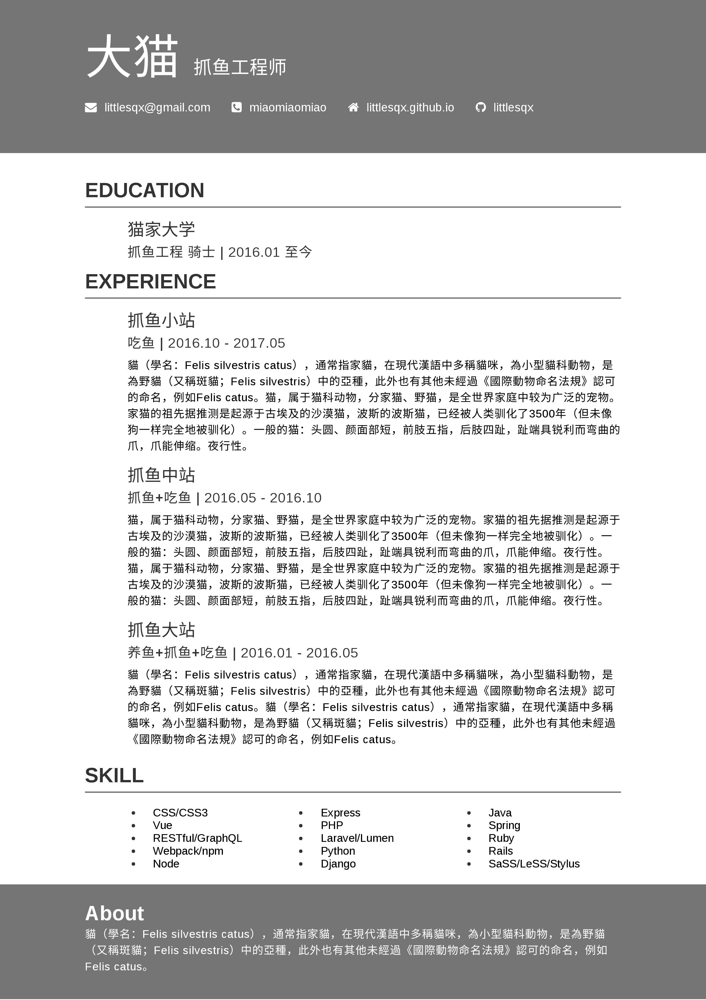

# leaf-resume

An online-tool helps to create better resume. [Live demo](https://littlesqx.github.io/leaf-resume/)




## Build Setup

``` bash
git clone https://github.com/Littlesqx/leaf-resume.git

npm install

npm run dev # for dev

npm run build # for prod

```
## Thanks

The resume theme is modifed from [@salomonelli - best-resume-ever/purple](https://github.com/salomonelli/best-resume-ever)

Also, this project is based on the following packages

[Vue](https://vuejs.org) / [Element](http://element.eleme.io)
